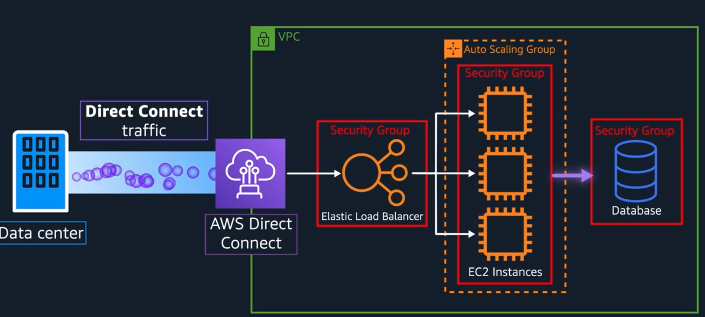
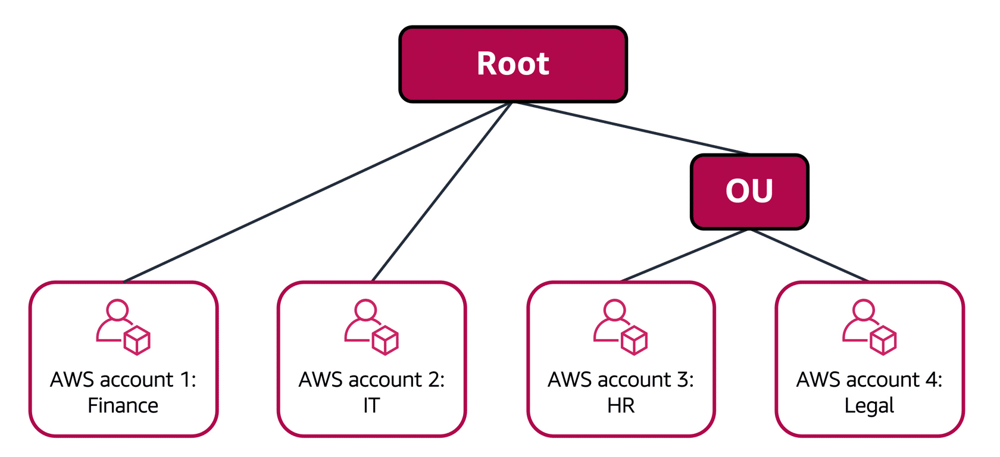

## AWS Cloud Practitioner Essentials Notes

#### Amazon EC2
**Amazon EC2** is a virtualized (Virtual Machine) server inside a phisical amazon service that is shared across multiple applications (multi-tenancy). We can compare the EC2 with a Phisical Server from the real World, that you request and create with the capacity you want.
- You configure the OS you want to use (Linux or IOS)
- You decide what do install there: Internal Applications, Web Servers, Databases, etc.
- EC2 Instances are resizable, you can change the capacity/resources of the server when you want. (vertical scaling)
- You control the networking aspect: type of request allowed to your server, public or private access, etc.
- Amazon EC2 is `CaaS (Compute as a Service)` - You don't need to worry about the phisical server, you just need to worry about the resources you need to run your application.

**Types of EC2 Instances**
Each type has different combination of resources:

- General purpose: (_Balance between CPU, Memory and Networking_) for: Webservers / Compute repositories
- Compute optimized (_Compute intensive tasks_): Gaming servers; High performance computing (HPC); Scientific modeling
- Memory optimized: (Memory intensive tasks): proccess large things in memory in a fast way
- Accelerated computing (_Utilize hardware accelerators_): Floating point number calc, Graphics processing; Data pattern matching
- Storage optimized: High performance for locally stored data

**EC2 Instances Prices**
Ordering: More expansive to less expansive 
- On-Demand: Only pay per duration.
- Saving Plans: Offers lows price in trade of a commiment to a consistent usage
- Reserved Instances: When you commit for this instance in 1 or 3 year commitment. 
- Spot instances: Can be 90% cheaper than OnDemand BUT the catch here is that AWS can request this instance back anytime, it notifies you 2 minutes before turning the instance down. This type is ideal for proccess that can be interrupted like batches 
- Dedicated Hosts: Basically a phisical server only for you, suitable when you have law requiriments of not sharing the same hardware with other companies/proccess, so in this case it's not a multi-tenancy approach like the default AWS strategy.

#### Scalability
When working on-premise, you have to predict the high work loads and buy a hardware accordingly BUT it can be a waste of money if you don't use most of the time. Your worse, you buy a hardware to handle the average workload and you're not ready for peaks.

AWS/Cloud is different because you can scape up and down whenever you need.

Types of scalling:
- Up (Vertical): Add more resource to the instance
- Out (Horizontal): Add more instances

Amazon has auto-scale solution `Amazon EC2 Auto Scaling to an application`, where you scale up to your demand. In this solution you can configure
- Minimum: Number of instances AWS is going to deploy once you start the app
- Desired: The number of number that is desired (if not provided will use the Minium as desired)
- Maximum: The max instances you want to run, the limit.

---

#### Elastic Load Balancing (ELB)
To handle this situation where you have multiple instances BUT you can balance (load) the load between them.

Your App can have its own Load Balancer BUT AWS has this Load Balancer solution called `Elastic Load Balancer` where it does it automatically for you.

The ELB also scales up (itself) with no costs if we have more incoming traffic. It can be used for external (client class) and internal traffic (services talking to each other)

---

#### Amazon SNS and Amazon SQS
Amazon products based on Pub/Sub (Queue/Topic) pattern for async processing providing `Loosely coupled architecture`.

**Amazon Simple Queue Service [SQS]**
Basically a QUEUE instance hosted my AWS
- Send/Store/Receive messages (containing payload) between pieces of software at any volume

**Amazon Simple Notification Service [SNS]**
Basically a TOPIC instance hosted by AWS
- Pub/Sub approach where a Publisher publish to a Topic and N subscribers can read the same message from that topic.

---

### Amazon Serverless Solutions

Serverless: You can't see or access the underlying infrastructure that are hosting your app (so you also don't have to manage, like patching, etc) 

**AWS Lambda**: Where you can `upload your code` in a "Lambda Function", `configure a Trigger`, the server `waits for the Trigger`, when the trigger is Met, the code is run in a env you should not worry about it.
- AWS Lambda scale your Lambda functions according to your workload input.
- Are designed to `run code < 15 minutes`, so it does't work for heavy proccess like Deep Learning, is suitable for things like back end services handling requests for example. 

If you want a middle term between serverless, you can choose containers options (Docker Container), where you can deploy your app in a container and "manage the container configs".

- **Amazon Elastic Container Service (ECS)**: Help to run containerized appls at scale without need to manage your container orchestration software.
- **Amazon Elastic Kubernetes Service (EKS)**: Similar thing but with different tooling and features.

They can both run on top of EC2 (your own instance) but you need a way/tool to manage containers (container orchestration), if you don't want to do that, you can use `AWS Fargate` is a serveless compute plataform for ECS/EKS.

### Summary of when use each of AWS solutions:
- **Amazon EC2**: Traditional applications and want full access to the OS
- **AWS Lambdas**: short running functions; event driven appls, DON'T want to manage server at all.  
- **Amazon ECS** or **Amazon EKS**: Run Docker container based workloads on AWS, then choose your plataform
  - EC2: That you manage
  - AWS Fargate: Serveless environment that is managed for you

---

### High availability and fault tolerance

AWS has global infra structure, meaning that your app can run across multiple locations, it provides HA and FaultTolerance in case of disaster in a specific place/context.

#### Region
Regions are places where AWS put multiple data centers to serve your business needs, like São Paulo have a bunch of servers, you can decide to deploy your App there so Latency between São Paulo customers and your App are going to be low.

Regions are separated, meaning that one region DOES NOT send/share data with other regions, unless you grant this permission, this is useful for security complience, like government ones for example.
Some business requirements to choose your app region:
- Compliance: Like Data must live in a specific place.
- Proximity: How close your app is from your main costumers (latency)
- Feature Availability: Some regions may not have all AWS features (may AWS did not install the hardware in there yet)
- Pricing: Some regions are more expansive from others, Brazil is much more expansive than US for example.

#### Zones
Group of Data Center or One Data center is called `Zone` (or AZ), and Region is consisted in N `Zones` that are phisically isolated. The Zones are not next to each other, this to try to prevent disasters. AWS recomends running at least 2 availability zones in a Region.

AWS provides "Regional Services" solutions, like the ELB (Elastic Load Balancer), that run across multiple regions to direct the workload balance between in your instances that may be running multiple across regions/zones.

---

#### CDN
CDN (Content Delivery Network) is basically a local copy of the central server that you place closer to the customer, like, if your App is far way from a country that has many customers, your place a CDN close to that country to have lower latency. This copy can be resources, files, etc.
**Amazon has a CDN service** called `Amazon CloudFront`

#### Amazon CloudFront
Helps deliver data, app, videos with low-latency, uses `Edge Locations`, it's like Edge Places where the copy of your content is placed to be closer to some places and reduce latency. You can push your content to a specific list of edge locations depending on your needs.
Example: Your App runs on Brazil, but the Customer is from Tokyo, Instead of requiring your customers to get their data from Brazil, you can cache a copy locally at an edge location that is close to your customers in China.

Edge locations runs CDNs and also other services like DNS services like `Amazon Route 53`.
We also have `AWS Outposts`, they basically install their service into your own building to run AWS Infrastucture in your Data Center (Extend AWS infrastructure and services to your on-premises data center) 

---

#### How to interact with these AWS Resources?
Basically through API Calls (Application Programming interfaces), you can create Lambda Functions, EC2 Instances.
To interact with the AWS Services:

**AWS Management Console**: Browser based and can manage the AWS Resources visually, good for:
- Test environments
- View AWS bills
- View monitoring
- Work with non-technical resources

**AWS Command Line Interface (CLI)**: Make API calls using the terminal on your PC. Like this you can create scripts to perform specific actions interacting with AWS services and automate this.

**AWS Software Development Kits (SDKs)**: Interact with AWS resources using varios programming languages (like a Lib/JAR)

**AWS Elastic Beanstalk**: Your basically tell this service what's your App code and desired config (how many instances, load balancer configs, etc), and it will manage it for you. This config is saved and can be replicable easilly in the future, the ideia of this solution is to focus on your business and let the services take care of the Infra Structure for you.

**AWS Cloud Formation**: Infrastructure as code tool used to define AWS resources to be deployed, you define this in a JSON or YML file listing the resources you want, so you have a template that can be reused to deploy that resources everytime you need. `It helps you define WHAT you want but not worring about HOW`. It supports a bunch of AWS services like: Storage, Analytics, ML, etc.

---

### Amazon Virtual Private Cloud (Amazon VPC)
Lets you create a logically isolated section on the AWS Cloud where you can put AWS resource in networks we define. They can be public (internet access) or private (not internet). The public and private groupoing of resources are called sub-nets they are ranges of IP addresses in our VPC.

We can define a private network on AWS to put our resources and restrict access to a range of private IPs. 

#### VPC connection from the External World

VPCs are private with means you have to "attach adapters" to it to enable external calls and there are some ways you can do it according to your needs:
- To allow your VPC to public traffic: You attach a `Internet Gateway` to your VPC.
- To allow your VPC for private traffic: You attach a `Virtual Private Gateway` to your VPC
  

- `AWS Direct Connect`: Stablish Completly private fiber connection from your data center to AWS. Work with a direct connect partner in your area (establish a private dedicated connection between your company’s data center and AWS)
  

The technical reason to use sub-nets on VPC is to conttrols access to the gateways, the Public ones has access to the internet, the Private ones Don't.
This way we can isolate resources we want to be public or don't.

Sub-nets can also control Traffict Permissions by Network access control list (Network ACL)

#### Network ACL (Network access control list)
Basically a permission list to control the content that can get into the network. It controls based on
- White or Black List IPs/users/origins 
- Control who can enter and ALSO WHO CAN LEAVE! By entering doesn't mean you're going to leave.

#### Security Group
A access control in the EC2 level (inside the VPC), for when you need different access permission at the Server level.

By default all EC2 instances come with a Security Group not allowing any kind of request from any IP to any port, you configure the way you want to: access specific types of request, IP, etc.
Different from `ACL`, the security group **only validates the entrance**. This because there is this state different

Having this flow as example, EC Instance1 trying to send a package to EC Instance B.
`Subnet1 (EC Instance A) -> Subnet1 (EC Instance B)`

**Deliver**
- EC2 InstanceA `SecurityGroup` allows the message to leave
- Subnet1 `Network ACL` validates and allow
- Subnet2 `Network ACL` validates and allow
- EC2 InstanceB `SecurityGroup` allows the message to enter

**Response Return**
- Both EC2 InstanceA `SecurityGroup` DOES NOT validate it again, it "remembers" (stateful) the request come in and allow.
- Both Subnet1 `Network ACL` VALIDATES it again, it DOES NOT remember (stateless) about the original request.

---

### DNS
Its like a translate service, it translates IP to Domains URLs. When the user enter a Adress, we route it to a IP.

#### Amazon Route 53
The amazon service that does this routing, the user enters the domain name `Amazon Route 53` redirects the user to the related Amazon service instance. But that's not all, with this service you can configure this routing to be smart to:

- Latency-based routing
- Geolocation DNS: Traffic from one place is redirected to a closer region/zone where your app runs
- Geoproximity routing
- Weidghted round-robin

---

## Module 6: Storage and Databases
Exam scheduled for this Friday

### Instance volume
Depending on the EC2 instance you start it comes with an "Instance Store Volumes" that let's you store data there BUT this storage is attached to this EC2 instance (same lifecycle), if you terminate this the data will be deleted as well.
You should use this storage for not important data, like temp files or data that can be easilly recreated.

### Amazon Elastic Block Store (EBS) [Block Storage]
You can create virtual hard-drives (EBS volumes) that we can attach to EC2 instances. You define the EBS Volume you want by choosing Size, Types and Configs. It also allows incremental backups (snapshot).

---

### Amazon Simple Storage Service (Amazon S3) [Object Storage]
- You can upload any type of file to Amazon S3, such as images, videos, text files, etc.
- Store data as objects that basically are composed of Data + Key and Metadata
- Amazon S3 offers unlimited storage space. The maximum file size for an object in Amazon S3 is 5 TB.

There are different tiers/classes you can define your data, it changes the price and the way you can access it, you should decide based on **How often you plan to retrieve your data** AND **How available you need your data to be**:
- Standard: frequently accessed + Stores data in a minimum of three Availability Zones
- S3 Standard-Infrequent Access (S3 Standard-IA): Similar to Amazon S3 Standard but has a lower storage price and higher retrieval price 
- S3 One Zone-Infrequent Access (S3 One Zone-IA): Stores data in a single Availability Zone + Has a lower storage price than Amazon S3 Standard-IA
- S3 Glacier Options (there are 3): Ideal for archival storage and the options vary according to how fast you need to access+how long you need to keep

PS: You can configure to move between all these options automatically, like, if you don't access a file for 30 days, it moves to a cheaper option.

#### Difference between Block Storage (EBS) and Object Storage (S3)
Block storage breaks those files into small components, meaning that if you need to perform a little change in a 80GB file you don't need to upload all the file again.
In the Object storage, every record is a object and if you need to perform a change on it, you need to upload everything again BUT the access is faster because each object has a unique URL and you can index it better depending on the context.

**Summary:**
_This means, if you are using complete objects or only occasional changes, S3 is victorious. If you are doing complex read, write, change functions, then, absolutely, EBS is your knockout winner.

---

### Amazon Elastic File System (EFS)
Is a managed file system. Is very similar to EBS but with a big difference. EBS stores data in a Single Avaliability Zone, because you attach a EBS to a EC2 instance in the same zone.
The EFS is different, you store data in multiple Availability Zones, it scale up and "duplicate data" so it can be accessed across multiple zones and also On-Premisse instances can access this data topp.

---

### Amazon Relational Database (RDS)
Service that lets you run relation databases in the AWS Cloud. It supports like: MySql, Postgrees, Oracle, Microsoft and others

#### Amazon Aurora
Is an enterprise-class relational database, It is compatible with MySQL and PostgreSQL relational databases. It's faster than standard MYSQL DBs

---

### Amazon DynamoDB
It's a NoSQL Key-Value database provided by Amazon. It delivers single-digit millisecond performance at any scale.
It's serverless and auto-scale -> VERY FAST and Scalable considering its nosql characteristics. 

---

### Amazon Redshift
Data warehousing as a Service, massively scalable and used for Big Data BI Solutions / Analytics.
It offers the ability to collect data from many sources and helps you to understand relationships and trends across your data.

---

### AWS Database Migration Service (AWS DMS)
Used to migrate SQL, NoSQL and other types of data stores, you just select the source and the target; they can of different types and be both on premise or in AWS.
During the migration, your source database remains operational, reducing downtime for any applications that rely on the database. 
Other usecases for DMS: 
- Develop and test migrations / 
- Database consolidation (combine several DBS into one) / 
- Continuos Replication

---

### Additional database services:
- Amazon Document DB: document database service that supports MongoDB workloads.
- Amazon Neptune is a graph database service: run applications that work with highly connected datasets, such as recommendation engines, fraud detection, and knowledge graphs.
- Amazon Quantum Ledger Database (Amazon QLDB) is a ledger database service: Ex review a complete history of all the changes that have been made to your application data.
- Amazon Managed Blockchain is a service that you can use to create and manage blockchain networks with open-source frameworks.
- Amazon ElastiCache is a service that adds caching layers on top of your databases to help improve the read times of common requests. It supports two types of data stores: Redis and Memcached.
- Amazon DynamoDB Accelerator (DAX) is an in-memory cache for DynamoDB. It helps improve response times from single-digit milliseconds to microseconds.

---

## Module 7: Security 

### AWS Identity and Access Management (IAM)
Enables you to manage access to AWS services and resources securely. IAM are based on
- **IAM users, groups, and roles**: You create a user, and you can define access to things such as "mazon EC2 instance or creating an Amazon S3 bucket" to the user direcly or put the user in a group/add roles and define these permissions.
- **IAM policies**: Document that allows or denies permissions to AWS services and resources. 

PS: An IAM role is an identity that you can assume to gain temporary access to permissions. (Before an IAM user, application, or service can assume an IAM role, they must be granted permissions to switch to the role)

---

### AWS Organizations
Consolidate and manage multiple AWS accounts within a central location by using service control policies (SCPs), Enable you to place restrictions on the AWS services, resources, and individual API actions that users and roles in each account can access.

#### Organizational units
In AWS Organizations, you can group accounts into organizational units (OUs) to make it easier to manage accounts with similar business or security requirements. When you apply a policy to an OU, all the accounts in the OU automatically inherit the permissions specified in the policy.  

**Which identities and resources can SCPs be applied to?** **An individual member account** AND **An organizational unit (OU)**

---

#### Compilance
AWS implements some complience needs and you need to see what fits for you and adapt in your needs
There's a solution called **AWS Artifact**, that is a service that provides on-demand access to AWS security and compliance reports and select online agreements

---

### Denial-of-service (DoS) attack
Is a deliberate attempt to make a website or application unavailable to users, trying to call your Apps multiple times from different sources.

AWS Provides 2 solutions for hosted Application on AWS:
- AWS Shield Standard: No cost, protects from commom DDoS ataccks, 
- AWS Shield Advanced: Paid, Provides more detailed diagnostics on the attacks and you can customize rules to mitigate complex DDos attacks

---

### Additional security services:
- AWS Key Management Service (AWS KMS): enables you to perform encryption operations through the use of cryptographic keys
- AWS WAF: is a web application firewall that lets you monitor network requests that come into your web applications
- Amazon Inspector: Reminds Veracoe Scans, It checks applications for security vulnerabilities and deviations from security best practices, such as open access to Amazon EC2 instances and installations of vulnerable software versions. 
- Amazon GuardDuty: provides intelligent threat detection for your AWS infrastructure and resources

---
---

## Module 7: Monitoring & Analytics

### Amazon CloudWatch
Similar to Dynatrace, it enables you to monitor and manage various metrics and configure alarm actions based on data from those metrics.

### AWS CloudTrail
Records API calls for your account, basically a log of actions related to your account so you can check: WHO/WHERE/WHAT was done like: users being created by who, permissions changes, new resources, etc. There's also "CloudTrail Insights" that baiscally automatically detect unusual API activities in your AWS account

### AWS Trusted Advisor
Inspects your AWS environment and provides real-time recommendations in accordance with AWS best practices in five categories: cost optimization, performance, security, fault tolerance, and service limits. There's a dashboard you can see the 5 categories and recomendations 

---
---

## Module 8: Pricing & Support

### AWS Free Tier Services
Some AWS services are free to use and are divided in 3 categories
- Always Free: Don't limit, use for how long and quantity you wat
- 12 Months Free: 1 year free to test
- Trial: Especial condition to try that differ from: Hours of usage, times of usage, etc. Each service have its own rules

### How AWS Pricing Works
- **Pay for what you use**: No commitment, you pay only the time you start/stop the service.
- **Pay less when you reserve**:  Basically when you commit to a certain amount of usage you have more discounts.
- **Pay less when you use more**: For example, Services like S3 when you use more space, the price per/gb get's lower.

### AWS Pricing Calculator
Lets you explore AWS services and create an estimate for the cost of your use cases on AWS. Basically you put the things you would need and can compare the costs in general like per region for example, and also separe them by group

#### Billing Dashboard
Where you can analyse your usage, costs, compare with previous months and pay your bill

#### Consolided Billing
When using AWS Organizations where you manage accounts, access and things like that there's a option of "Consolidated Billing" where you can combine/pay costs or manage it somehow, you can also configure to share resources between the orgs/accounts, etc

#### AWS Bugets
You can create budgets to plan your service usage, service costs, and instance reservations. You can define budget by service/account/resource and create alerts when it's about to get used in full for example.

#### AWS Cost Explorer
Tool that lets you visualize, understand, and manage your AWS costs and usage over time. It provides you graphics and data about the costs my month, resource, etc

#### AWS Support
You can hire AWS support in different levels and prices:
- Basic Support is free for all AWS customers.
- Developer support: Best practice guidance; Client-side diagnostic tools; Building-block architecture support.
- Business Support: 
  - Use-case guidance to identify AWS offerings, features, and services that can best support your specific needs; 
  - All AWS Trusted Advisor checks;
  - Limited support for third-party software, such as common operating systems and application stack components

#### AWS Market Place
Digital catalog that includes thousands of software listings from independent software vendors

---

## Module 9: Migration and Innovation

### AWS Cloud Adoption Framework (AWS CAF)
Is a Framework created to help companies to move to cloud, it focus in 6 Perspective: 
- Business: IT aligns with business needs and that IT investments link to key business results
- People: Supports development of an organization-wide change management strategy for successful cloud adoption.
- Governance: focuses on the skills and processes to align IT strategy with business strategy. This ensures that you maximize the business value and minimize risks
- Plataform: Principles and patterns for implementing new solutions on the cloud, and migrating on-premises workloads to the clou
- Security: Ensures that the organization meets security objectives for visibility, auditability, control, and agility
- Operations: Helps you to enable, run, use, operate, and recover IT workloads to the level agreed upon with your business stakeholders

### 6 strategies for migration
- Rehosting: Known as “lift-and-shift” involves moving applications without changes.
- Replatforming: Also known as “lift, tinker, and shift,” involves making a few cloud optimizations to realize a tangible benefit.
- Refactoring/re-architecting: Involves reimagining how an application is architected and developed by using cloud-native features
- Repurchasing: involves moving from a traditional license to a software-as-a-service model. For example, a business might choose to implement the repurchasing strategy by migrating from a customer relationship management (CRM) system to Salesforce.com.
- Retaining: Keeping applications that are critical for the business in the source environment.
- Retiring: Removing applications that are no longer needed.

### AWS Snow Family
Collection of physical devices that help to physically transport up to exabytes of data into and out of AWS. 
Basically using phisical devices from AWS (Little device or even a Truck for larger data) to move data INTO and OUT AWS depending on what you need.
IT'S NEEDED BECAUSE DOING THIS OVER INTERNET COULD TAKE MONTHS depending on the size!

- AWS SNOWCONE: small, rugged, and secure edge computing and data transfer device. It features 2 CPUs, 4 GB of memory, and up to 14 TB of usable storage.
- AWS SNOWBALL
  - Storage Optimized: well suited for large-scale data migrations and recurring transfer workflows: Storage: 80 TB of hard disk drive (HDD) | Compute: 40 vCPUs, and 80 GiB of memory 
  - Compute Optimized: provides powerful computing resources for use cases such as machine learning: Storage: 80-TB usable HDD  | Compute: 104 vCPUs, 416 GiB of memory
- AWS SnowMobile (a Fucking Truck): an exabyte-scale data transfer service used to move large amounts of data to AWS. 

### Innovation with AWS (services that help you in different aspects)
- Servless aoplications: AWS Lambda for example
- Machine Learning: Amazon SageMaker
- Artifical Intelligence 
  - Amazon CodeWhispere: Get code recommendations while writing code and identify security issues in your code with 
  - Amazon Transcribe: Convert speech to text
  - Amazon Comprehend: Discover patterns in text
  - Amazon Fraud Detector: Identify potentially fraudulent online activities
  - Amazon Lex: Amazon Lex

---

## Module 10: The Cloud Journey

### AWS Well-Architected Framework
Helps you understand how to design and operate reliable, secure, efficient, and cost-effective systems in the AWS Cloud, it's based on 6 pillars
* Operational excellence: Run and monitor systems to deliver business value and to continually improve supporting processes and procedures
* Security: to protect information, systems, and assets while delivering business value through risk assessments and mitigation strategies.
* Reliability: Recover from infrastructure or service disruptions; Dynamically acquire computing resources to meet demand; Mitigate disruptions such as misconfigurations or transient network issues
* Performance efficiency: is the ability to use computing resources efficiently to meet system requirements and to maintain that efficiency as demand changes and technologies evolve.
* Cost optimization: run systems to deliver business value at the lowest price point.
* Sustainability: Continually improve sustainability impacts by reducing energy consumption and increasing efficiency across all components of a workload by maximizing the benefits from the provisioned resources and minimizing the total resources required.

